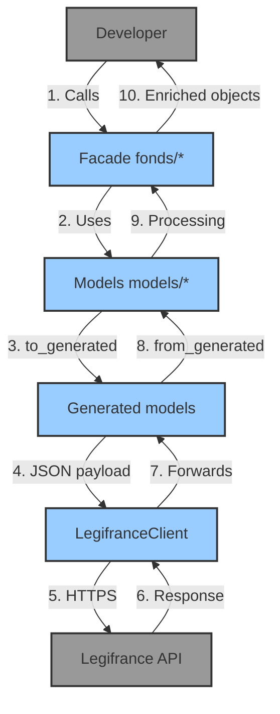

Layered architecture:

```
User → fonds/ (facades) → models/ (domain) → models/generated/ → client.py → Legifrance API
```

1. **Domain facades** (`fonds/`) — high-level API per documentary fond
   (`Code`, `JuriAPI`, `Loda`).
2. **Domain models** (`models/<fond>/`) — business structures validated by
   Pydantic (search, consult, results).
3. **Generated models** (`models/generated/`) — auto-generated from the
   Legifrance OpenAPI schema. See
   [`/en/concepts/generated-models`](/pylegifrance/en/concepts/generated-models/).
4. **API client** (`client.py`) — HTTPS/JSON communication, auth, timeouts.

## Why this separation?

The goal is to **separate the user interface from the technical logic**.

- **`fonds/`**: domain facade
  - Stable, intuitive API for developers and legal professionals.
  - Hides the complexity of the Legifrance API.
  - Provides enriched business objects.
  - Protects client code from upstream API changes.

- **`models/`**: data models
  - Precise structure of legal data.
  - Validation via Pydantic (strong typing, constraints).
  - Bidirectional conversion with API models.
  - Organized by technical concern.

See [`/en/concepts/fond-facade`](/pylegifrance/en/concepts/fond-facade/) for
the detailed reasoning.

## Data flow



## C4 diagrams

The C4 diagrams (context, containers, components) are described in PlantUML
source in the legacy MkDocs docs and in
[`raw/legifrance/`](https://github.com/pylegifrance/pylegifrance/tree/main/docs/raw)
(awaiting pre-rendered SVG for native display in Starlight).

## Key benefits

- **Stability**: public interface independent of API changes.
- **Business models**: features specific to the legal domain.
- **Robust validation**: typing and Pydantic validation.
- **Intuitive structure**: organized by documentary fond.

## See also

- [`/en/concepts/builder-pattern`](/pylegifrance/en/concepts/builder-pattern/)
- [`/en/concepts/fond-facade`](/pylegifrance/en/concepts/fond-facade/)
- [`/en/concepts/generated-models`](/pylegifrance/en/concepts/generated-models/)
